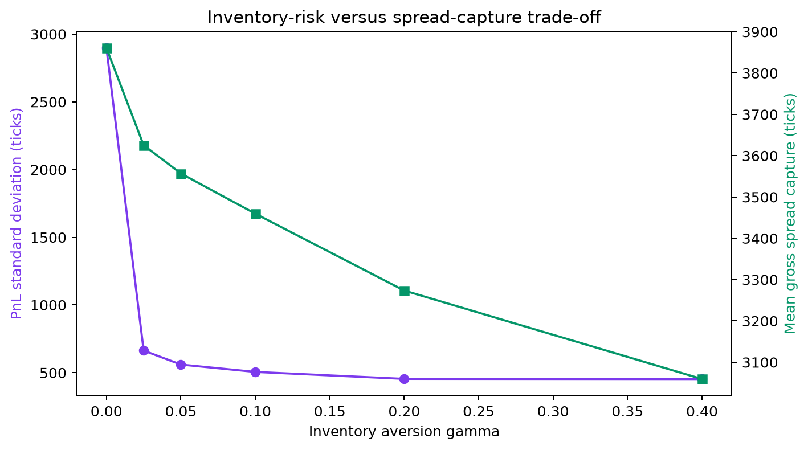
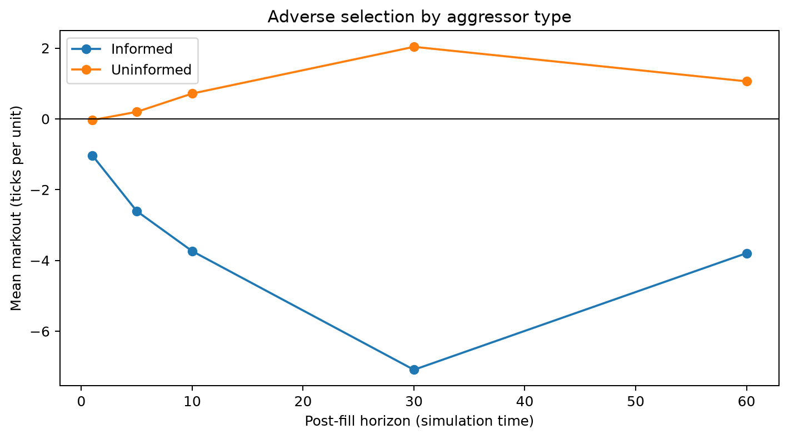
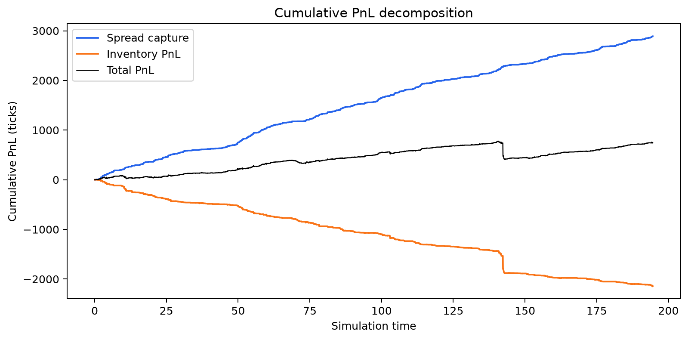
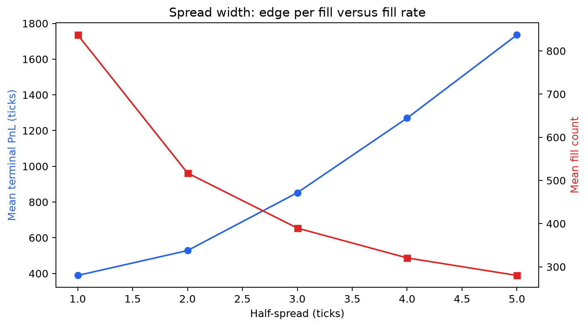

# Limit Order Book & Market-Making Simulator

[](https://github.com/TariqEl-Jumaily/order-book-market-maker/actions/workflows/ci.yml)

A tested Python 3.12 simulator for studying price-time-priority matching,
inventory risk, and adverse selection under synthetic continuous-time order flow.

The project is an educational market-microstructure model. It does **not** claim
live deployment, historical-market validation, or real trading performance.

New to trading or market microstructure? Start with the
[beginner's study book](docs/study-book.md). It explains the terminology, code,
experiments, CV wording, limitations, and planned next steps from first principles.

## Main result

Across 200 common random seeds per setting, moving from no inventory skew to
`gamma = 0.1`:

| Metric | gamma = 0 | gamma = 0.1 | Change |
|---|---:|---:|---:|
| Terminal-PnL standard deviation | 2,897 ticks | 506 ticks | **-82.5%** |
| Mean gross spread capture | 3,861 ticks | 3,460 ticks | **-10.4%** |
| Mean maximum absolute inventory | 100 units | 25.7 units | **-74.3%** |
| Mean terminal PnL | -5,310 ticks | 389 ticks | +5,699 ticks |
| Mean / standard deviation | -1.83 | 0.77 | Not annualized |

The unskewed strategy reached the configured 100-unit inventory limit in every
session. Linear quote skew greatly reduced this exposure, at a much smaller cost
to gross spread capture.



## How the simulator works

The matching engine uses integer price ticks, `SortedDict` price levels, and
FIFO `OrderedDict` queues. Crossing limit orders execute immediately; only their
unfilled remainder can rest.

The synthetic market uses competing continuous-time hazards:

- passive limit-order arrivals;
- aggressive market orders;
- cancellation intensity proportional to active background orders; and
- independent latent fair-value shocks.

Twenty percent of market orders are classified as informed. When latent value
differs from the midpoint, they trade toward it and size up with the signal.
Uninformed direction is symmetric. The market maker quotes around

```text
reservation price = midpoint - gamma * inventory
```

and suppresses exposure-increasing quotes at its inventory limit.

## Evidence

### Adverse selection

For the documented seed-42 run, informed fills had a -7.09 tick/unit mean
30-time-unit markout, compared with +2.04 ticks/unit for uninformed fills.
Markouts start from the post-event midpoint and use the first midpoint observed
at or after each requested horizon.



### PnL accounting

For signed quantity `dq` (positive buys, negative sells):

```text
cash change     = -dq * fill_price
spread capture  = sum(dq * (pre_event_mid - fill_price))
inventory PnL   = sum(post_event_inventory * midpoint_change)
total PnL       = cash + terminal_inventory * terminal_mid
```

Every simulation asserts that spread capture plus inventory PnL reconciles to
marked-to-market PnL within `1e-9`.



### Spread-width sweep

Wider quotes reduce fills, as expected. In this calibrated synthetic model,
mean PnL continues increasing from one to five ticks rather than forming the
expected interior optimum. That negative result is retained: the tested range
or flow model does not make wide quotes sufficiently difficult to fill.



Additional figures show the [depth profile](results/figures/01-depth-profile.png),
[quote path](results/figures/02-mid-and-quotes.png), and
[inventory distribution](results/figures/05-inventory-distribution.png).

## Architecture

```text
src/lobmm/
  order_book.py       price-time-priority matching and cancellation
  order_flow.py       event hazards, informed flow, and active-order pool
  market_maker.py     linear inventory-skew strategy and accounting
  simulation.py       seeded event loop and reproducible records
  analytics.py        PnL, markouts, diagnostics, and bootstrap intervals
  experiments.py      parallel sweeps, persistence, and seven figures
  cli.py               command-line interface
configs/
  baseline.toml        complete reproducible parameter set
tests/                 47 unit and integration tests
results/figures/       committed headline outputs
```

### Matching complexity

Let `P` be populated price levels, not total orders.

| Operation | Complexity | Detail |
|---|---:|---|
| Best bid / ask | O(1) | Peek at an endpoint of the sorted level map |
| Add passive limit | O(log P) | Insert or find its price level |
| Cancel | Average O(1), sometimes O(log P) | Hash lookup/FIFO removal; deleting the final order removes its level |
| Aggressive match | O(fills + crossed levels x log P) | FIFO fills plus removal of consumed levels |

On the development machine, the included benchmark submitted roughly 494,000
resting orders per second. This is a local indicative number, not a portable CI
performance guarantee.

## Reproduce it

```bash
python3.12 -m venv .venv
source .venv/bin/activate
python -m pip install --upgrade pip
python -m pip install -e '.[dev]'

# One fully logged session
python -m lobmm simulate --seed 42

# Individual 200-seed sweeps
python -m lobmm spread-sweep --runs 200 --workers 8
python -m lobmm gamma-sweep --runs 200 --workers 8

# Both sweeps and all seven figures
python -m lobmm report --runs 200 --workers 8
```

Raw batch outputs live under `results/raw/` and are intentionally ignored by
Git. The compact summary and headline figures are committed.

## Quality gates

```bash
ruff check .
mypy src
pytest
python benchmarks/benchmark_order_book.py --orders 100000
```

The current suite has 47 passing tests and 94% statement coverage. Tests include
price/time priority, partial fills, multi-level walks, cancellations, deterministic
seeds, quote skew, inventory limits, informed-flow direction, exact PnL
reconciliation, persistence, CLI behavior, and report generation.

## Limitations and next steps

- Synthetic flow omits real queue-position behavior, latency, fees/rebates,
  autocorrelated order flow, and strategic agents.
- The midpoint can temporarily use the last valid reference if a side empties.
- Markouts and experiment results are properties of this calibrated model, not
  estimates of real market profitability.
- A stronger next validation would replay LOBSTER message data and compare depth,
  spread, trade-size, and markout distributions.
- Avellaneda-Stoikov quoting, a C++ hot path, and explicit latency remain stretch
  goals rather than hidden v1 claims.
